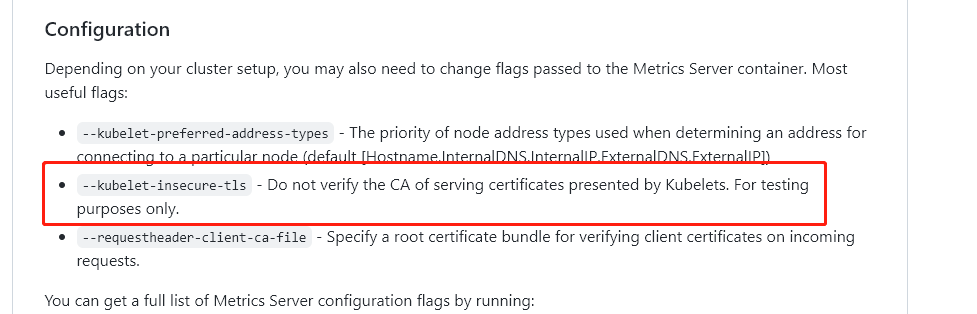

github链接
https://github.com/kubernetes-sigs/metrics-server
从github拉取yaml文件
curl -o metrics-server.yaml https://github.com/kubernetes-sigs/metrics-server/releases/download/v0.6.3/components.yaml
修改metrics-server.yaml文件
需要修改2处
1、安装要求，如下红框中说明，Kubelet证书需要由群集证书颁发机构签名（或可以禁用证书验证，通过对Metrics Server配置参数--Kubelet-insecure-tls不安全）

配置，如下红框中说明，添加了--Kubelet-insecure-tls这个配置，就不会去验证Kubelets提供的服务证书的CA。只能在测试环境哦-不安全

修改之前的apply的components.yaml文件，添加--Kubelet-insecure-tls参数，

–kubelet-insecure-tls：kubelet 的10250端口使用的是https协议，连接需要验证tls证书。–kubelet-insecure-tls不验证客户端证书
    spec:
      containers:
      - args:
        - --cert-dir=/tmp
        - --secure-port=4443
        - --kubelet-preferred-address-types=InternalIP,ExternalIP,Hostname
        - --kubelet-use-node-status-port
        - --metric-resolution=15s
        - --kubelet-insecure-tls			#添加这一行
2、修改image为国内镜像
        image: registry.aliyuncs.com/google_containers/metrics-server:v0.6.0

apply yaml
kubectl apply -f metrics-server.yaml
查看pod
```
[root@master ~]# kubectl get pods -A
kube-system    metrics-server-7dcb58647-qtz88   1/1     Running   0              10m
```
验证
```
[root@master ~]# kubectl top node
NAME     CPU(cores)   CPU%   MEMORY(bytes)   MEMORY%   
master   121m         6%     1019Mi          59%       
node1    30m          1%     357Mi           20%       
node2    114m         5%     882Mi           51%   
```