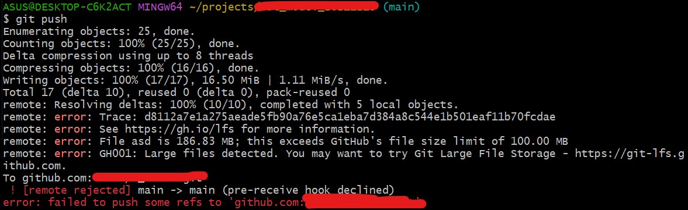
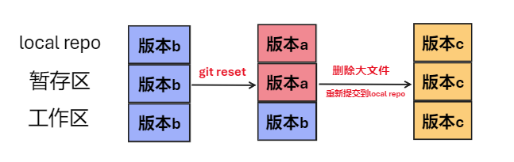
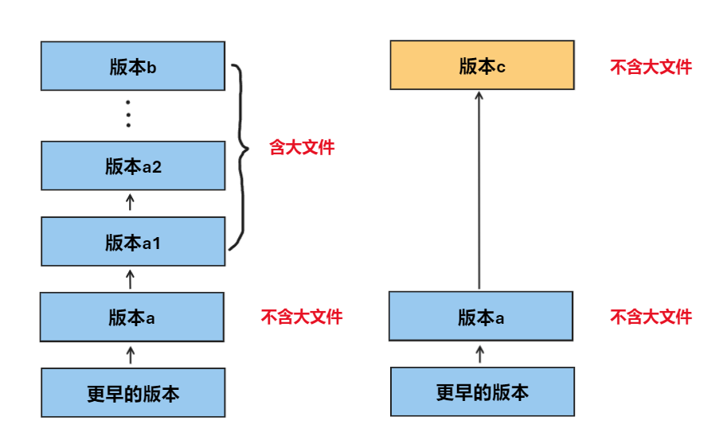

git push提交时提示有大于100M的大文件，无法提交
删除大文件后重新add commit push后仍提示有大于100M的大文件

原因git push时会把本地仓库的历史版本全部push到remote，所以之前commit的版本包含大于100M的文件，push失败了，现在再push还是会失败

使用git log查看commit记录，使用git reset将暂存区和本地仓库回退到没有大文件的版本，工作区保持不动
然后删除工作区的大文件，重新将工作区的变更提交到暂存区

查看历史版本
 git log	
将本地仓库和暂存区回退到没有大文件的版本
 git reset  c50d5543142067fc3581c46aac1d4d28af0e0afd
删除大文件
 rm  x.tar
重新
 git add . 
 git commit -m ''
再push
 git push

git reset 和git reset --hard的区别
git reset只回退本地仓库和暂存区，不会改变工作区
git reset --hard会回退工作区，工作区内更新的代码会丢失